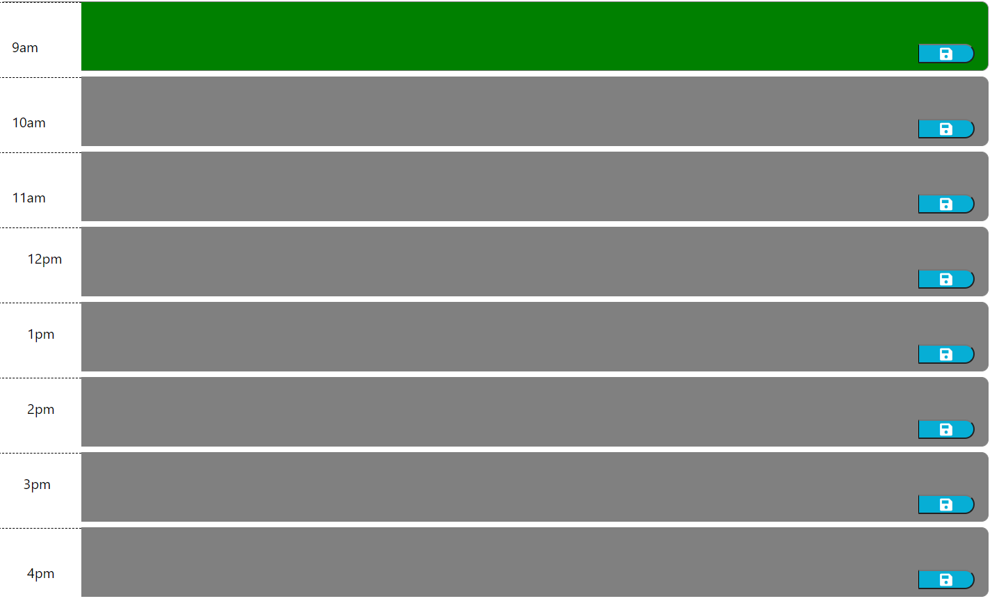
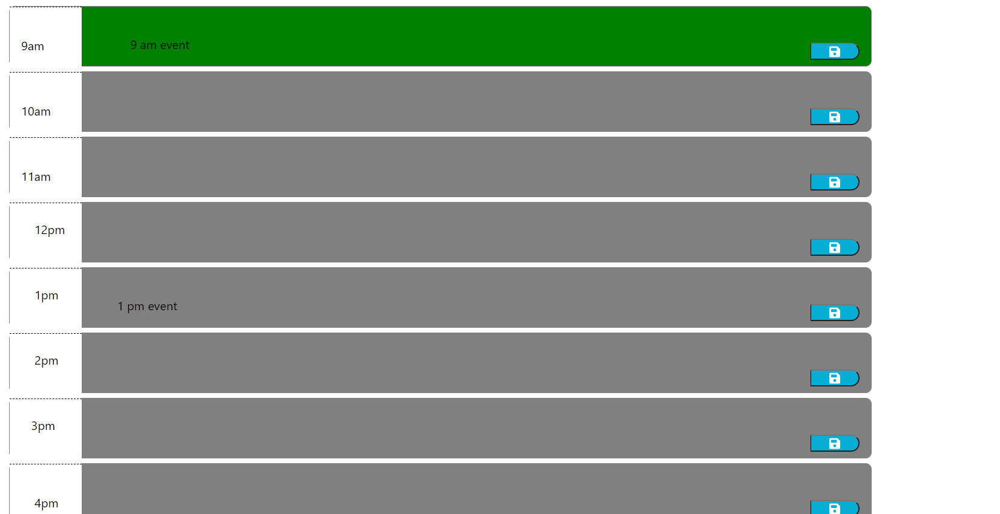
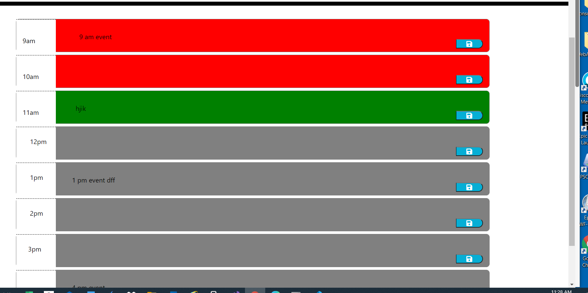

# work-day-scheduler-10.6.20

---

## About The Project

---

Implemented the code to workday planner application.
Once user open the application,the time block's colors will be displayed as below:

-    if current time equals to time block time,then green color will be displayed.
-    if current time less than to time block time,then gray color will be displayed.
-    if current time greater than to time block time,then red color will be displayed.
-    after enter text in textarea and click save button ,the item will be saved in localstorage with corresponding time block.
-    after page refresh the event will be displayed

## script.js

-    Implemented the following functionalities
-    setUpTimeBlockColors: display the color of the time block depending on time
-    initializeToDoList : initialize the ToDoList before saves the events in localstorage
-    renderSchedule : to display time and corresponding events
-    saveItem : will be called after user clicked save button to save items in localstorage

## index.html

-    Implemented the code for workday planner

## css

-    added different varieties of styles to html pages using css selectors
-    used id,class and tag selectors

## Built With

-    javascript
-    JQuery
-    html
-    css

## Getting Started

To get a local copy up and running follow below steps.

## Prerequisites

None

## Installation

Clone the repo
git clone git@github.com:NirmalaAbothu/work-day-scheduler-10.6.20.git

## Credits

Followed the documentation of https://www.w3schools.com/ for jquery and google documents

## License & copyright

Copyright © 2020 Nirmala Abothu

## Deployed project link

[work-day-scheduler](https://nirmalaabothu.github.io/work-day-scheduler-10.6.20/)
